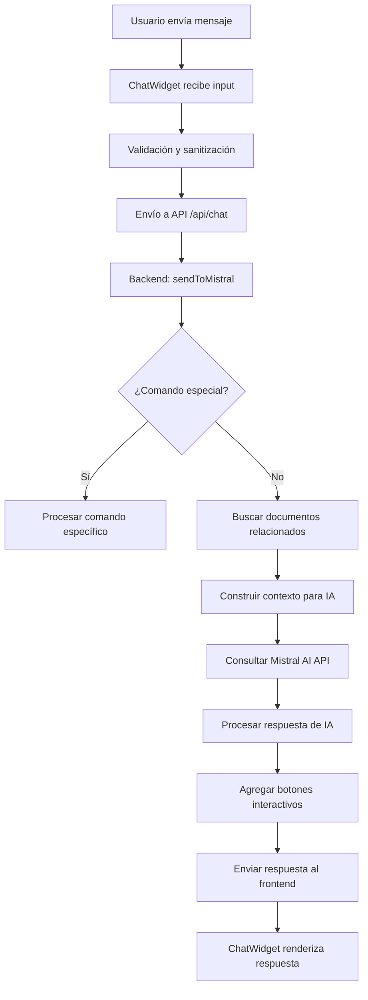

# Chatbot SIG UniQuindío

## Descripción General

Este proyecto es un **Sistema de Asistente Virtual** desarrollado para la Universidad del Quindío que permite a estudiantes, profesores y personal administrativo consultar, buscar y acceder a los documentos del **Sistema Integrado de Gestión (SIG)** mediante inteligencia artificial conversacional.

## 🎯 Objetivo Principal

Proporcionar una interfaz conversacional inteligente que facilite el acceso a la documentación oficial del SIG de la Universidad del Quindío, mejorando la experiencia del usuario al buscar información institucional mediante procesamiento de lenguaje natural.

## 🏗️ Arquitectura del Sistema

### Arquitectura General
```
┌─────────────────┐    ┌─────────────────┐    ┌─────────────────┐
│                 │    │                 │    │                 │
│   Frontend      │───▶│    Backend      │───▶│   Mistral AI    │
│   (React)       │    │   (Node.js)     │    │     API         │
│                 │    │                 │    │                 │
└─────────────────┘    └─────────────────┘    └─────────────────┘
         │                       │                       
         │                       ▼                       
         │              ┌─────────────────┐              
         │              │                 │              
         └─────────────▶│  Email Service  │              
                        │  (Nodemailer)   │              
                        │                 │              
                        └─────────────────┘              
```

## 🔧 Stack Tecnológico

### Frontend
- **React 18.x**: Biblioteca principal para la interfaz de usuario
- **React Router DOM**: Navegación entre páginas
- **Framer Motion**: Animaciones y transiciones suaves
- **React Markdown**: Renderizado de contenido markdown
- **React Icons**: Iconografía del sistema
- **CSS Modules**: Estilos modulares y variables CSS

### Backend
- **Node.js**: Runtime de JavaScript
- **Express.js**: Framework web para APIs REST
- **Mistral AI API**: Modelo de lenguaje para procesamiento de consultas
- **Nodemailer**: Servicio de envío de correos electrónicos
- **CORS**: Habilitación de peticiones cross-origin
- **dotenv**: Gestión de variables de entorno

## 📁 Estructura del Proyecto

```
Chatbot-SIG-Uniquindio/
├── frontend/                     # Aplicación React
│   ├── public/
│   │   ├── index.html           # Página principal HTML
│   │   └── images/              # Recursos gráficos
│   ├── src/
│   │   ├── components/          # Componentes reutilizables
│   │   │   ├── Chat/           # Componentes del chat
│   │   │   ├── Systems/        # Componentes de sistemas
│   │   │   └── UI/             # Componentes de interfaz
│   │   ├── pages/              # Páginas principales
│   │   ├── services/           # Servicios de comunicación
│   │   └── styles/             # Estilos CSS
│   └── package.json
├── backend/                      # API Node.js
│   ├── data/
│   │   └── sigKnowledge.js     # Base de conocimientos del SIG
│   ├── routes/
│   │   └── chatBotRoutes.js    # Rutas de la API
│   ├── services/
│   │   └── mistralServices.js  # Servicios de IA y email
│   └── server.js               # Servidor principal
├── documents/                   # Documentos PDF del SIG
│   └── VIG-SGL-BPM-INT-08.pdf
└── README.md
```

## 🧠 Funcionamiento Técnico

### 1. Frontend - Interfaz de Usuario

#### Componentes Principales

- **ChatWidget.jsx**: Componente principal del chat que maneja:
  - Estado de mensajes y conversaciones
  - Comunicación con la API backend
  - Formularios dinámicos para soporte y envío de documentos
  - Renderizado de markdown en respuestas
  - Indicadores de escritura y carga

- **ChatPage.jsx**: Página dedicada al chat con:
  - Sidebar con historial de conversaciones
  - Sistema de conversaciones fijadas
  - Filtros por sistemas (SIAC, SGSST, SGA, SGL, SSI)

#### Sistema de Navegación
```javascript
// Rutas principales definidas en App.js
<Route path="/" element={<HomePage />} />
<Route path="/chat" element={<ChatPage />} />
<Route path="/systems" element={<SystemsPage />} />
<Route path="/systems/:systemId" element={<SystemDetailPage />} />
<Route path="/search" element={<SearchPage />} />
<Route path="/documents/:documentId" element={<DocumentPage />} />
```

#### Gestión de Estado
- **useState**: Para estado local de componentes
- **useEffect**: Para efectos secundarios y ciclo de vida
- **useCallback**: Para optimización de funciones
- **useRef**: Para referencias a elementos DOM

### 2. Backend - Procesamiento y API

#### Servidor Principal (server.js)
```javascript
const app = express();
app.use(cors());
app.use(express.json());
app.use('/api', chatRoutes);

// Compatibilidad con Rasa (legacy)
app.post('/webhooks/rest/webhook', async (req, res) => {
  // Procesamiento de mensajes
});
```

#### Rutas API (chatBotRoutes.js)

| Endpoint | Método | Descripción |
|----------|---------|-------------|
| `/api/chat` | POST | Procesar mensajes del chat |
| `/api/reset` | POST | Reiniciar conversación |
| `/api/documents/search` | GET | Buscar documentos |
| `/api/documents/:id` | GET | Obtener documento específico |
| `/api/documents/send-email` | POST | Enviar documento por correo |
| `/api/support-request` | POST | Solicitar soporte técnico |

#### Servicios de IA (mistralServices.js)

##### Procesamiento de Lenguaje Natural
```javascript
const sendToMistral = async (userMessage) => {
  // 1. Detectar intenciones especiales (envío de correos, múltiples destinatarios)
  // 2. Buscar documentos relacionados
  // 3. Construir contexto para Mistral AI
  // 4. Procesar respuesta de IA
  // 5. Manejar comandos especiales
};
```

##### Funcionalidades Avanzadas
- **Detección de múltiples correos**: Reconoce y procesa listas de correos electrónicos
- **Búsqueda contextual**: Encuentra documentos relevantes basados en palabras clave
- **Gestión de conversaciones**: Mantiene historial contextual
- **Envío de documentos**: Sistema robusto de envío por email con fallbacks

### 3. Base de Conocimientos (sigKnowledge.js)

Estructura de datos para documentos del SIG:
```javascript
const sigKnowledge = [
  {
    id: "VIG-SGL-BPM-INT-08",
    topic: "Instructivo de Capacitación en Plantas Piloto",
    summary: "Documento que detalla el manejo administrativo...",
    content: "Contenido extraído del PDF...",
    applicationContext: "Capacitación del personal operativo...",
    downloadURL: "https://intraweb2024.uniquindio.edu.co/...",
    filePath: "path/to/document.pdf",
    keywords: ["capacitación", "plantas piloto", "instructivo"],
    category: "Capacitación"
  }
];
```

## 🔄 Flujo de Procesamiento de Mensajes



## 🔍 Funcionalidades Clave

### 1. Búsqueda Inteligente de Documentos
```javascript
const searchDocuments = (query) => {
  const keywords = query.toLowerCase().split(/\s+/);
  return sigKnowledge.filter(doc => {
    return keywords.some(word => 
      doc.topic.toLowerCase().includes(word) ||
      doc.keywords.some(k => k.includes(word)) ||
      doc.content.toLowerCase().includes(word)
    );
  });
};
```

### 2. Envío Masivo de Documentos
- Detección automática de múltiples direcciones de correo
- Procesamiento secuencial para evitar spam
- Reportes detallados de éxito y fallos
- Sistema de retry automático

### 3. Formularios Dinámicos
El sistema incluye formularios contextuales para:
- Solicitud de soporte técnico
- Envío de documentos por correo
- Contacto con especialistas

### 4. Sistema de Botones Interactivos
Generación automática de botones basados en el contexto:
```javascript
// Detección de IDs de documentos
const docIds = [...response.matchAll(/([A-Z]+-[A-Z]+-\d+)/g)];
docIds.forEach(id => {
  buttons.push({
    text: `Descargar ${id}`,
    value: `Quiero descargar el documento ${id}`
  });
});
```

## 🎨 Sistema de Diseño

### Variables CSS (variables.css)
```css
:root {
  /* Colores institucionales UniQuindío */
  --uniquindio-green: #00843d;
  --uniquindio-dark-blue: #223b73;
  --uniquindio-orange: #ff9e1b;
  
  /* Espaciado consistente */
  --space-xs: 8px;
  --space-sm: 12px;
  --space-md: 16px;
  --space-lg: 24px;
  
  /* Chat específico */
  --chat-width: 400px;
  --chat-height: 600px;
}
```

### Componentes de UI Reutilizables
- **Header**: Navegación principal con logo institucional
- **Footer**: Información de contacto y enlaces
- **ChatToggle**: Botón flotante para activar el chat
- **PageTransition**: Animaciones entre páginas

## 📧 Sistema de Correo Electrónico

### Configuración Nodemailer
```javascript
const transporter = nodemailer.createTransporter({
  host: 'smtp.gmail.com',
  port: 587,
  secure: false,
  auth: {
    user: process.env.EMAIL_USER,
    pass: process.env.EMAIL_PASS
  }
});
```

### Características del Sistema de Email
- **Adjuntos automáticos**: Los PDFs se adjuntan cuando están disponibles
- **HTML enriquecido**: Plantillas profesionales con branding institucional
- **Manejo de errores robusto**: Fallbacks y mensajes informativos
- **Verificación de entrega**: Logs detallados y confirmaciones

## 🚀 Instalación y Configuración

### Prerrequisitos
- Node.js 16.x o superior
- npm o yarn
- Cuenta de Mistral AI
- Credenciales SMTP para envío de correos

### Backend
```bash
cd backend
npm install
```

Crear archivo `.env`:
```env
MISTRAL_API_KEY=your_mistral_api_key
MISTRAL_API_URL=https://api.mistral.ai/v1/chat/completions
EMAIL_USER=your_email@gmail.com
EMAIL_PASS=your_app_password
PORT=5005
```

```bash
npm start
```

### Frontend
```bash
cd frontend
npm install
npm start
```

## 🔧 Variables de Entorno

| Variable | Descripción | Requerido |
|----------|-------------|-----------|
| MISTRAL_API_KEY | Clave API de Mistral AI | ✅ |
| MISTRAL_API_URL | URL base de la API de Mistral | ✅ |
| EMAIL_USER | Usuario SMTP para envío de correos | ✅ |
| EMAIL_PASS | Contraseña/App Password SMTP | ✅ |
| PORT | Puerto del servidor backend | ⚪ |
| REACT_APP_API_URL | URL del backend para el frontend | ⚪ |

## 🧪 Testing y Desarrollo

### Comandos Disponibles (Frontend)
```bash
npm start          # Desarrollo
npm test           # Tests unitarios
npm run build      # Build de producción
npm run eject      # Exponer configuración
```

### Modo de Simulación
El sistema incluye un modo de simulación para desarrollo sin conexión a Mistral AI:
```javascript
// En chatService.js
return new Promise((resolve) => {
  setTimeout(() => {
    resolve([{
      text: `Respuesta simulada para: "${message}"`,
      buttons: [/* botones de prueba */]
    }]);
  }, 1000);
});
```

## 🔍 Monitoreo y Logs

### Sistema de Logging
```javascript
console.log(`[${new Date().toISOString()}] 📩 INICIANDO ENVÍO MÚLTIPLE`);
console.log(`📄 Documento: ${documentId}`);
console.log(`👥 Destinatarios (${emails.length}): ${emails.join(', ')}`);
```

### Métricas Disponibles
- Mensajes procesados
- Documentos enviados por correo
- Errores de procesamiento
- Tiempos de respuesta de IA

## 🚦 Estados de la Aplicación

### Estados del Chat
- **Idle**: Esperando input del usuario
- **Typing**: Usuario escribiendo
- **Loading**: Procesando con IA
- **Form Active**: Formulario dinámico activo
- **Error**: Error en procesamiento

### Estados de Documento
- **Available**: Documento disponible para descarga
- **Sending**: Enviando por correo
- **Sent**: Enviado exitosamente
- **Failed**: Error en envío

## 🔐 Seguridad

### Medidas Implementadas
- **Validación de entrada**: Sanitización de mensajes
- **Rate limiting**: Control de frecuencia de requests
- **CORS configurado**: Solo orígenes permitidos
- **Validación de correos**: Regex para validar emails
- **Manejo seguro de archivos**: Verificación de rutas

## 📈 Optimizaciones de Rendimiento

### Frontend
- **Code splitting**: Carga lazy de componentes
- **Memoización**: useCallback y useMemo
- **Optimización de re-renders**: Keys apropiadas
- **Bundle analysis**: Análisis de tamaño

### Backend
- **Caché de conversaciones**: Historial en memoria
- **Pool de conexiones**: Reutilización de conexiones
- **Compresión de respuestas**: Gzip habilitado

## 🔄 Roadmap y Mejoras Futuras

### Funcionalidades Planeadas
1. **Base de datos persistente**: PostgreSQL/MongoDB
2. **Autenticación de usuarios**: JWT tokens
3. **Analytics avanzados**: Métricas de uso
4. **Soporte multiidioma**: i18n implementation
5. **API de WebSockets**: Chat en tiempo real
6. **Integración con SSO**: Single Sign-On universitario

### Mejoras Técnicas
- **Testing automatizado**: Jest + Cypress
- **CI/CD pipelines**: GitHub Actions
- **Containerización**: Docker + Docker Compose
- **Monitoring**: Prometheus + Grafana

## 🤝 Contribución

Este proyecto está desarrollado para la Universidad del Quindío como parte del trabajo del grupo de IA. Para contribuciones o reportes de bugs, contactar al equipo de desarrollo a través de los siguientes correos.

---

**Desarrollado por**: Estudiantes de la Universidad del Quindío  
**Contacto**: luisc.calderonc@uniquindio.edu.co & juanm.amadorr@uqvirtual.edu.co 
